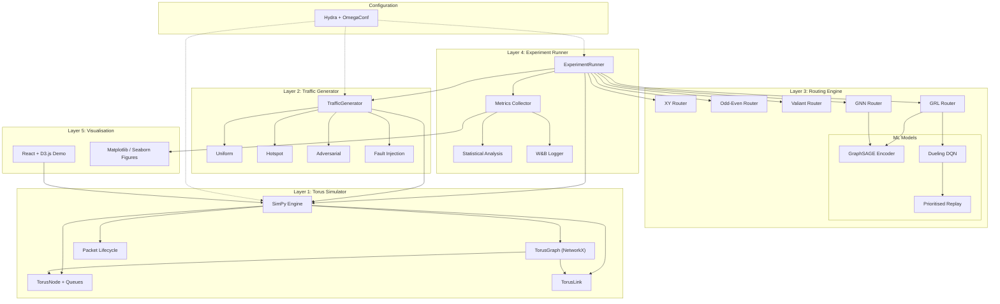

# GRL-Torus: Implementation Plan

> Graph Reinforcement Learning for Adaptive Routing in 2D Torus Optical Interconnects

## Background

This plan implements the full GRL-Torus system per the PRD: a SimPy-based 2D torus network simulator, three baseline routers (XY, Odd-Even, Valiant), a GraphSAGE GNN encoder, a DQN policy agent, an automated experiment runner, and a visualisation layer. The project lives at `C:\Projects\Optical Project\` and targets a public GitHub release with a research paper.

---

## Resolved Decisions

> [!NOTE]
> **Compute Environment**: ✅ **CPU-preferred**. GPU is available but CPU will be used by default. Device set to `"cpu"` in all configs. Topology sizes up to 32×32 retained but with CPU-optimised batch sizes.

> [!NOTE]
> **Experiment Tracking**: ✅ **No W&B**. All logging goes to local **CSV + TensorBoard**. W&B integration deferred to later. A `--wandb` opt-in flag will be available if needed.

> [!NOTE]
> **Odd-Even Routing**: ✅ **Option A — Virtual Channels**. Odd-Even routing implemented with 2 virtual channels per physical link to properly handle torus wraparound cycles. Faithful to Chiu (2000) literature for paper credibility.

> [!NOTE]
> **GNN Training Strategy**: ✅ **Option 3 — Both variants**. Implement both (a) pretrained GNN → frozen encoder → DQN on top, and (b) pretrained GNN → unfrozen encoder → joint DQN training. Required for the ablation study comparison.

---

## Proposed Changes

The project is structured into **5 phases** matching the PRD timeline, with each phase producing independently testable deliverables. All code lives under `C:\Projects\Optical Project\`.

### Repository Structure

```
C:\Projects\Optical Project\
├── conf/                          # Hydra configuration (OmegaConf)
│   ├── config.yaml                # Root config — defaults list
│   ├── topology/
│   │   ├── torus_4x4.yaml
│   │   ├── torus_8x8.yaml
│   │   ├── torus_16x16.yaml
│   │   └── torus_32x32.yaml
│   ├── traffic/
│   │   ├── uniform.yaml
│   │   ├── hotspot.yaml
│   │   ├── adversarial.yaml
│   │   └── fault.yaml
│   ├── router/
│   │   ├── xy.yaml
│   │   ├── odd_even.yaml
│   │   ├── valiant.yaml
│   │   ├── gnn.yaml
│   │   └── grl.yaml
│   ├── training/
│   │   ├── gnn_supervised.yaml
│   │   └── dqn.yaml
│   └── experiment/
│       ├── full_grid.yaml
│       └── ablation.yaml
├── src/
│   ├── __init__.py
│   ├── sim/                       # Module F1 + F2: Simulator
│   │   ├── __init__.py
│   │   ├── torus_graph.py         # Torus graph builder (NetworkX + PyG export)
│   │   ├── node.py                # Node model with directional queues
│   │   ├── link.py                # Link model with utilisation tracking
│   │   ├── packet.py              # Packet dataclass with lifecycle tracking
│   │   ├── simulator.py           # SimPy discrete-event engine
│   │   └── traffic.py             # Traffic generator (4 patterns)
│   ├── routers/                   # Module F3 + F4 + F5: Routing Engines
│   │   ├── __init__.py
│   │   ├── base.py                # Abstract Router interface
│   │   ├── xy_router.py           # XY deterministic routing
│   │   ├── odd_even_router.py     # Odd-Even adaptive routing
│   │   ├── valiant_router.py      # Valiant load balancing
│   │   ├── gnn_router.py          # GNN supervised routing
│   │   └── grl_router.py          # GRL (GNN+DQN) routing
│   ├── models/                    # Module F4 + F5: Neural Networks
│   │   ├── __init__.py
│   │   ├── graphsage.py           # GraphSAGE encoder (PyG SAGEConv)
│   │   ├── dqn.py                 # Dueling DQN Q-network
│   │   ├── replay_buffer.py       # Prioritised Experience Replay (Sum-Tree)
│   │   └── training.py            # Training loops (supervised + RL)
│   ├── experiments/               # Module F6: Experiment Runner
│   │   ├── __init__.py
│   │   ├── runner.py              # Grid experiment orchestrator
│   │   ├── metrics.py             # Metric collection and aggregation
│   │   └── analysis.py            # Statistical analysis (t-tests, Cohen's d)
│   ├── viz/                       # Module F7: Visualisation (Python side)
│   │   ├── __init__.py
│   │   ├── paper_figures.py       # Matplotlib/Seaborn paper figures
│   │   └── torus_animation.py     # Matplotlib animated torus (fallback)
│   └── utils/
│       ├── __init__.py
│       ├── seeding.py             # Global seed management
│       └── logging.py             # Structured logging setup
├── demo/                          # Module F7: React animated demo
│   ├── package.json
│   ├── src/
│   │   ├── App.jsx
│   │   ├── components/
│   │   │   ├── TorusGrid.jsx
│   │   │   ├── PacketAnimation.jsx
│   │   │   └── ControlPanel.jsx
│   │   └── hooks/
│   │       └── useSimulation.js
│   └── public/
├── tests/
│   ├── __init__.py
│   ├── test_torus_graph.py
│   ├── test_routing.py
│   ├── test_simulator.py
│   ├── test_traffic.py
│   ├── test_gnn.py
│   ├── test_dqn.py
│   └── test_integration.py
├── notebooks/
│   ├── 01_explore_torus.ipynb
│   ├── 02_training_analysis.ipynb
│   └── 03_results_figures.ipynb
├── scripts/
│   ├── train_gnn.py               # CLI: python scripts/train_gnn.py
│   ├── train_dqn.py               # CLI: python scripts/train_dqn.py
│   ├── run_experiments.py          # CLI: python scripts/run_experiments.py
│   └── generate_figures.py         # CLI: python scripts/generate_figures.py
├── results/                       # Auto-generated experiment outputs
│   ├── csv/
│   ├── figures/
│   └── checkpoints/
├── docs/                          # MkDocs documentation
│   ├── mkdocs.yml
│   └── docs/
│       ├── index.md
│       ├── architecture.md
│       └── api.md
├── requirements.txt
├── pyproject.toml
├── README.md
├── LICENSE
└── .github/
    └── workflows/
        └── ci.yml                 # GitHub Actions CI
```

---

### Phase 1: Foundation — Torus Simulator + XY Routing (Week 1–2)

This phase builds the core simulation engine. Everything downstream depends on a correct, deterministic SimPy torus simulator.

---

#### [NEW] [pyproject.toml](file:///C:/Projects/Optical%20Project/pyproject.toml)

Project metadata and build configuration. Uses `setuptools` backend with `src` layout. Defines all dependencies with pinned versions:

| Category | Packages |
|----------|----------|
| Core Sim | `simpy>=4.1`, `networkx>=3.2` |
| ML | `torch>=2.2`, `torch-geometric>=2.5`, `torch-scatter`, `torch-sparse` |
| Config | `hydra-core>=1.3`, `omegaconf>=2.3` |
| Experiment | `wandb>=0.16`, `pandas>=2.1`, `numpy>=1.26` |
| Viz | `matplotlib>=3.8`, `seaborn>=0.13` |
| Stats | `scipy>=1.12` |
| Testing | `pytest>=8.0`, `pytest-cov` |

---

#### [NEW] [conf/config.yaml](file:///C:/Projects/Optical%20Project/conf/config.yaml)

Root Hydra config. Defines defaults list composing topology, traffic, router, and training sub-configs. Key top-level params:

```yaml
defaults:
  - topology: torus_8x8
  - traffic: uniform
  - router: xy
  - _self_

simulation:
  duration_ns: 1_000_000        # 1ms simulated time
  tick_resolution_ns: 1
  warmup_ns: 100_000            # Discard first 100µs for steady-state

node:
  buffer_depth: 64              # Max packets per directional queue
  
link:
  bandwidth_gbps: 100           # Per-link bandwidth
  propagation_delay_ns: 1       # Propagation delay

seed: 42
device: "cpu"                   # GPU available, CPU preferred
logging:
  backend: "tensorboard"        # "tensorboard" or "wandb"
  log_dir: "results/logs"
  csv_dir: "results/csv"
```

---

#### [NEW] [src/sim/torus_graph.py](file:///C:/Projects/Optical%20Project/src/sim/torus_graph.py)

**Core torus graph builder.** Responsible for FR-1.1 through FR-1.5.

- `class TorusGraph`:
  - `__init__(self, n: int)` — builds N×N torus via `nx.grid_2d_graph(n, n, periodic=True)`. Each node keyed by `(x, y)` tuple. Adds coordinate attributes.
  - `to_pyg(self, node_features: dict, edge_features: dict) -> torch_geometric.data.Data` — converts live graph state to PyG Data object with 8-dim node features and 3-dim edge features per the PRD spec.
  - `to_adjacency(self) -> np.ndarray` — exports adjacency matrix.
  - `inject_failures(self, failure_rate: float, seed: int)` — randomly marks `failure_rate` fraction of links as failed. Marks corresponding nodes as `is_failed=True` if all links dead.
  - `get_neighbors(self, node: tuple, direction: str) -> tuple` — returns the neighbor in the given direction (N/S/E/W) accounting for torus wraparound.
  - `shortest_path_weighted(self, src, dst, weight_fn)` — Dijkstra on congestion-weighted graph for GNN training label generation.

**Key design decision**: We store the NetworkX graph as the single source of truth for topology. The PyG export is a *snapshot* created on-demand for GNN inference. This avoids dual-state synchronisation bugs.

---

#### [NEW] [src/sim/node.py](file:///C:/Projects/Optical%20Project/src/sim/node.py)

- `class NodeQueue` — a fixed-capacity FIFO queue for one direction (N/S/E/W). Tracks occupancy over time.
- `class TorusNode`:
  - 4 × `NodeQueue` instances (one per direction)
  - `(x, y)` coordinates
  - `is_failed: bool`
  - `load: float` — exponential moving average of total queue occupancy
  - `get_features() -> np.ndarray` — returns 8-dim feature vector: `[queue_N, queue_S, queue_E, queue_W, x_norm, y_norm, load, is_failed]`

---

#### [NEW] [src/sim/link.py](file:///C:/Projects/Optical%20Project/src/sim/link.py)

- `class TorusLink`:
  - `src_node`, `dst_node` — endpoint tuples
  - `direction` — one of N/S/E/W
  - `bandwidth_gbps`, `propagation_delay_ns`
  - `failure_prob: float`, `is_failed: bool`
  - `utilisation: float` — rolling average bytes/capacity ratio
  - `get_features() -> np.ndarray` — returns 3-dim edge feature: `[utilisation, failure_prob, propagation_delay_ns]`

---

#### [NEW] [src/sim/packet.py](file:///C:/Projects/Optical%20Project/src/sim/packet.py)

- `@dataclass class Packet`:
  - `id: int`, `src: tuple`, `dst: tuple`
  - `creation_time: float`, `payload_size: int`
  - `hops: List[tuple]` — path trace
  - `queue_wait_time: float`, `transmission_time: float`
  - `delivered: bool`, `dropped: bool`
  - `total_latency` property — `delivery_time - creation_time`

---

#### [NEW] [src/sim/simulator.py](file:///C:/Projects/Optical%20Project/src/sim/simulator.py)

**The SimPy discrete-event engine.** This is the most critical file — it orchestrates packet lifecycle.

- `class TorusSimulator`:
  - `__init__(self, torus: TorusGraph, router: BaseRouter, config: DictConfig)` — initialises SimPy `Environment`, creates `TorusNode` and `TorusLink` objects for each graph node/edge.
  - `_packet_lifecycle(self, packet: Packet)` — SimPy process (generator):
    1. **Inject** — packet arrives at `src` node
    2. **Route** — call `router.route(packet, current_node, self.get_graph_state())` to get `next_hop`
    3. **Queue** — `yield` on the directional queue at `current_node` (blocks if full → packet drop after timeout)
    4. **Transmit** — `yield env.timeout(transmission_delay)` based on link bandwidth + propagation delay
    5. **Receive** — packet arrives at `next_hop`; if `next_hop == dst`, mark delivered; else loop to step 2
  - `get_graph_state() -> dict` — snapshot of all node features and edge features (used by GNN router)
  - `run(self, traffic_gen: TrafficGenerator) -> SimulationResults` — runs simulation for configured duration, returns collected metrics
  - `_collect_metrics(self) -> SimulationResults` — aggregates avg latency, p95 latency, throughput, drop rate, utilisation stats

**Critical detail**: The router is called **per-hop**, not per-packet. This is essential for GRL — the DQN makes a decision at every intermediate node, not just at the source.

---

#### [NEW] [src/sim/traffic.py](file:///C:/Projects/Optical%20Project/src/sim/traffic.py)

Traffic generator implementing FR-2.1 through FR-2.6.

- `class TrafficGenerator`:
  - `__init__(self, pattern: str, torus: TorusGraph, config: DictConfig)`
  - `generate(self, env: simpy.Environment) -> Generator` — SimPy process that yields packets at Poisson-distributed intervals
  - Pattern implementations:
    - **Uniform**: `src, dst = random.choice(nodes), random.choice(nodes)` (ensure src ≠ dst)
    - **Hotspot**: Select 20% of nodes as hotspots; 80% of traffic targets hotspots (configurable via `hotspot_ratio` in config)
    - **Adversarial**: Traffic concentrated along central rows `[N//4, 3N//4]` and columns — worst case for XY
    - **Fault**: Normal uniform traffic but with `inject_failures()` called on the torus before simulation

---

#### [NEW] [src/routers/base.py](file:///C:/Projects/Optical%20Project/src/routers/base.py)

Abstract base class ensuring all routers share the same interface (FR-3.4):

```python
class BaseRouter(ABC):
    @abstractmethod
    def route(self, packet: Packet, current_node: tuple, 
              graph_state: dict) -> tuple:
        """Returns next-hop node (x, y) tuple."""
        ...
    
    @abstractmethod
    def name(self) -> str: ...
```

---

#### [NEW] [src/routers/xy_router.py](file:///C:/Projects/Optical%20Project/src/routers/xy_router.py)

XY Routing (FR-3.1). Deterministic, deadlock-free.

- Routes X-dimension first (East/West toward destination column), then Y-dimension (North/South toward destination row)
- Uses **shortest direction** on the torus ring for each dimension (leveraging wraparound when N/2 < distance)
- Falls back to any non-failed link if the preferred direction is blocked by failure

---

#### [NEW] [src/routers/odd_even_router.py](file:///C:/Projects/Optical%20Project/src/routers/odd_even_router.py)

Odd-Even Routing (FR-3.2). Adaptive, deadlock-free with virtual channels.

**Implementation strategy** (pending user confirmation on Option A vs B):

- **Option A (recommended)**: 2 virtual channels per physical link
  - VC-0 used for wrap-around traversals, VC-1 for non-wrap-around
  - Turn restrictions applied per Chiu (2000):
    - Even columns: prohibit East→North, East→South
    - Odd columns: prohibit North→West, South→West
  - Route selection: among legal next-hops, pick the one with lowest queue occupancy (congestion-aware heuristic)

---

#### [NEW] [src/routers/valiant_router.py](file:///C:/Projects/Optical%20Project/src/routers/valiant_router.py)

Valiant Load Balancing (FR-3.3). Two-phase routing.

- **Phase 1**: Route packet from `src` to randomly chosen intermediate node `I` using XY routing
- **Phase 2**: Route packet from `I` to `dst` using XY routing
- Intermediate node `I` selected uniformly at random from all non-failed nodes (seed-controlled)
- Theoretically optimal load balance under adversarial traffic; 2× path length penalty under benign traffic

---

#### [NEW] [src/utils/seeding.py](file:///C:/Projects/Optical%20Project/src/utils/seeding.py)

Deterministic seeding for full reproducibility:

```python
def set_global_seed(seed: int):
    random.seed(seed)
    np.random.seed(seed)
    torch.manual_seed(seed)
    torch.cuda.manual_seed_all(seed)
    torch.backends.cudnn.deterministic = True
```

---

#### [NEW] [tests/test_torus_graph.py](file:///C:/Projects/Optical%20Project/tests/test_torus_graph.py)

- Test that N×N torus has exactly N² nodes and 2×N² edges (each node has 4 neighbors, each edge counted once per direction → 4×N²/2 undirected = 2N² edges)
- Test wraparound: node (0,0) connects to (N-1, 0), (0, N-1), (1, 0), (0, 1)
- Test PyG export produces correct `edge_index` shape: `[2, 4*N²]` (directed)
- Test failure injection at 10% → ~10% of edges marked failed
- Test shortest path on 4×4 torus matches known values

#### [NEW] [tests/test_routing.py](file:///C:/Projects/Optical%20Project/tests/test_routing.py)

- XY routing: verify path from (0,0) → (3,3) on 4×4 torus is exactly 3+3=6 hops (or 1+1=2 via wraparound)
- XY routing: verify always routes X first, then Y
- Odd-Even: verify no prohibited turns appear in any routing trace
- Valiant: verify intermediate node is always visited; path length ~ 2× XY
- All routers: verify packet eventually reaches destination on 4×4, 8×8 under all traffic patterns (no infinite loops)

#### [NEW] [tests/test_simulator.py](file:///C:/Projects/Optical%20Project/tests/test_simulator.py)

- Run 4×4 torus with XY routing, 100 packets uniform traffic — verify all packets delivered, latency > 0
- Run with full buffer (buffer_depth=1) — verify some packets dropped
- Run with 50% link failure — verify reduced throughput but no crash
- Verify determinism: same seed → identical metrics

---

### Phase 2: GNN Encoder — Supervised Training (Week 3–4)

With the simulator producing live graph states and Dijkstra-optimal labels, we train the GraphSAGE encoder.

---

#### [NEW] [src/models/graphsage.py](file:///C:/Projects/Optical%20Project/src/models/graphsage.py)

GraphSAGE encoder per PRD §4.3.

- `class GraphSAGEEncoder(nn.Module)`:
  - 3 × `SAGEConv` layers (PyG) with configurable hidden dims (default 128)
  - Aggregation: `mean` (robust to variable degrees)
  - Activation: ReLU between layers, none on final output
  - Input: 8-dim node features
  - Output: 64-dim per-node embedding
  - Optional `BatchNorm` between layers for training stability
  - `project=True` on first SAGEConv for input feature projection

```python
class GraphSAGEEncoder(nn.Module):
    def __init__(self, in_channels=8, hidden_channels=128, 
                 out_channels=64, num_layers=3):
        super().__init__()
        self.convs = nn.ModuleList()
        self.norms = nn.ModuleList()
        # Layer 1: 8 → 128
        self.convs.append(SAGEConv(in_channels, hidden_channels, 
                                    project=True))
        self.norms.append(BatchNorm(hidden_channels))
        # Layers 2–3: 128 → 128, then 128 → 64
        for i in range(1, num_layers):
            out = hidden_channels if i < num_layers - 1 else out_channels
            self.convs.append(SAGEConv(hidden_channels, out))
            if i < num_layers - 1:
                self.norms.append(BatchNorm(out))
    
    def forward(self, x, edge_index):
        for i, conv in enumerate(self.convs):
            x = conv(x, edge_index)
            if i < len(self.convs) - 1:
                x = self.norms[i](x)
                x = F.relu(x)
                x = F.dropout(x, p=0.1, training=self.training)
        return x  # [N, 64] embeddings
```

---

#### [NEW] [src/models/training.py](file:///C:/Projects/Optical%20Project/src/models/training.py)

Training loops for both supervised GNN and RL DQN.

**Supervised GNN Training** (`train_gnn_supervised()`):
1. **Data generation**: Run SimPy simulator under random traffic for 1,000 episodes per topology. At each timestep, snapshot graph state → compute Dijkstra shortest path on congestion-weighted graph → label = optimal next-hop direction (0–3 for N/S/E/W).
2. **Dataset**: Each sample = (PyG Data object with node/edge features, per-node next-hop label tensor). 80/10/10 split.
3. **Loss**: Cross-entropy over 4-class next-hop prediction per node.
4. **Optimiser**: Adam, lr=1e-3, weight_decay=1e-4, cosine annealing LR schedule.
5. **Batch size**: 32 graphs per batch (PyG `DataLoader`).
6. **Early stopping**: patience=10 on validation loss.
7. **Logging**: W&B — training loss, validation loss, validation accuracy, learning rate per epoch.
8. **Checkpoint**: Save best model (lowest val loss) to `results/checkpoints/`.

**Key implementation detail**: The GNN predicts a next-hop for *every* node simultaneously (not just the current node). During inference, we index into the embedding of the current node to get its routing decision. During training, the loss is computed over all nodes as a batch.

---

#### [NEW] [src/routers/gnn_router.py](file:///C:/Projects/Optical%20Project/src/routers/gnn_router.py)

GNN supervised router (FR-4.1 through FR-4.5).

- `class GNNRouter(BaseRouter)`:
  - Loads pretrained `GraphSAGEEncoder` checkpoint
  - On each `route()` call:
    1. Convert current graph state to PyG Data (`torus.to_pyg()`)
    2. Forward pass through GraphSAGE → get 64-dim embedding per node
    3. Feed current node's embedding through a learned classification head → 4-dim logits (N/S/E/W)
    4. Select `argmax` direction (greedy) → return next-hop node
  - **Caching**: Cache the GNN forward pass result for the current simulation tick — all packets routed within the same tick share the same graph embedding (avoids redundant computation)

---

#### [NEW] [tests/test_gnn.py](file:///C:/Projects/Optical%20Project/tests/test_gnn.py)

- Test GraphSAGE forward pass on 4×4 torus produces correct output shape `[16, 64]`
- Test training loop converges on toy 4×4 data (loss decreases over 10 epochs)
- Test checkpoint save/load round-trip
- Test GNN router produces valid next-hop (one of 4 neighbors)

---

### Phase 3: DQN Policy — Reinforcement Learning (Week 5–6)

The DQN agent uses GNN embeddings as state and learns to select optimal routing actions through reward maximisation.

---

#### [NEW] [src/models/dqn.py](file:///C:/Projects/Optical%20Project/src/models/dqn.py)

Dueling DQN Q-network per PRD §4.4.

- `class DuelingDQN(nn.Module)`:
  - Input: 69-dim vector = 64-dim GNN embedding of current node + 5-dim packet features `[src_x, src_y, dst_x, dst_y, hops_so_far]`
  - **Feature stream**: Linear(69, 256) → ReLU → Linear(256, 128) → ReLU
  - **Value stream**: Linear(128, 1)
  - **Advantage stream**: Linear(128, 5) (5 actions: N, S, E, W, Hold)
  - **Output**: `Q(s,a) = V(s) + (A(s,a) - mean(A(s,:)))` — Dueling architecture

```python
class DuelingDQN(nn.Module):
    def __init__(self, state_dim=69, action_dim=5):
        super().__init__()
        self.feature = nn.Sequential(
            nn.Linear(state_dim, 256), nn.ReLU(),
            nn.Linear(256, 128), nn.ReLU()
        )
        self.value = nn.Linear(128, 1)
        self.advantage = nn.Linear(128, action_dim)
    
    def forward(self, x):
        features = self.feature(x)
        value = self.value(features)
        advantage = self.advantage(features)
        q_values = value + advantage - advantage.mean(dim=-1, keepdim=True)
        return q_values
```

---

#### [NEW] [src/models/replay_buffer.py](file:///C:/Projects/Optical%20Project/src/models/replay_buffer.py)

Prioritised Experience Replay with Sum-Tree.

- `class SumTree` — binary tree for O(log N) priority-weighted sampling
- `class PrioritizedReplayBuffer`:
  - `capacity`: 100,000 transitions
  - `push(state, action, reward, next_state, done, priority)` — stores transition with initial max priority
  - `sample(batch_size, beta)` → `(batch, indices, is_weights)` — samples proportional to priority; returns importance-sampling weights
  - `update_priorities(indices, td_errors)` — updates priorities based on new TD-errors
  - `alpha=0.6` (prioritisation exponent), `beta` annealed from 0.4 → 1.0 over training

---

#### Modifications to [src/models/training.py](file:///C:/Projects/Optical%20Project/src/models/training.py)

Add DQN training loop (`train_dqn()`):

1. **Initialise**: Q-network, Target Q-network (hard copy), PER buffer, epsilon schedule
2. **Episode loop** (2,000 episodes per topology):
   a. Reset SimPy environment with random traffic
   b. For each packet routing decision:
      - Get GNN embedding of current graph state (from pretrained or jointly-trained encoder)
      - Concatenate with packet features → state vector (69-dim)
      - Select action: ε-greedy (random with prob ε, else argmax Q)
      - Execute action in SimPy → observe reward, next state, done
      - Store transition in PER buffer
      - Sample mini-batch from PER, compute TD loss, update Q-network
      - Every 500 steps: hard-copy Q-network weights → Target network
   c. Decay epsilon: linear from 1.0 → 0.05 over 10,000 steps
3. **Reward function**: `R = -latency_hop - 10 * packet_drop + 0.5 * link_util_reduction`
4. **Deadlock prevention**: If Hold action selected 3 consecutive times, force deflection (random non-Hold action)
5. **Logging**: W&B — per-episode reward, Q-value moving avg, epsilon, loss

**Joint training variant**: Unfreeze GNN encoder weights; gradients flow through GNN during DQN backward pass. Use lower learning rate (1e-4) for GNN layers.

---

#### [NEW] [src/routers/grl_router.py](file:///C:/Projects/Optical%20Project/src/routers/grl_router.py)

GRL Router (FR-5.1 through FR-5.7). Combines GNN + DQN for inference.

- `class GRLRouter(BaseRouter)`:
  - Loads pretrained `GraphSAGEEncoder` + trained `DuelingDQN`
  - `route()`:
    1. GNN forward pass → node embeddings (cached per tick)
    2. Extract current node embedding (64-dim)
    3. Concatenate packet features (5-dim) → 69-dim state
    4. DQN forward pass → 5 Q-values
    5. Select action = argmax Q (no exploration at inference)
    6. If action = Hold → check consecutive hold count; force deflection if > 3
    7. Return next-hop corresponding to selected direction
  - `_hold_counter: dict` — per-packet hold count for deadlock prevention

---

#### [NEW] [tests/test_dqn.py](file:///C:/Projects/Optical%20Project/tests/test_dqn.py)

- Test DuelingDQN forward pass: input [batch, 69] → output [batch, 5]
- Test PER buffer: push 1000 items, sample 32 → correct shapes + IS weights sum
- Test epsilon-greedy: at eps=1.0 → all random; at eps=0.0 → all greedy
- Test deadlock prevention: 4 consecutive Hold calls → forced deflection

---

### Phase 4: Experiment Runner + Analysis (Week 7–8)

Automated execution of all 1,600 experimental runs with statistical analysis.

---

#### [NEW] [src/experiments/runner.py](file:///C:/Projects/Optical%20Project/src/experiments/runner.py)

Grid experiment orchestrator (FR-6.1 through FR-6.5).

- `class ExperimentRunner`:
  - `__init__(self, config: DictConfig)` — parses grid dimensions from config
  - `run_grid()` — iterates over all combinations: `4 topologies × 4 traffic × 4 failure rates × 5 seeds × 5 routers = 1,600 runs`
  - Each run:
    1. Set global seed
    2. Build torus graph with failure injection
    3. Instantiate router
    4. Create traffic generator
    5. Run simulation for configured duration
    6. Collect metrics → append to results DataFrame
    7. Log to W&B (if enabled)
  - **Parallelisation**: `multiprocessing.Pool` for CPU-bound simulation runs. Each router type runs independently. GNN/GRL runs are single-process (GPU-bound).
  - `run_ablation()` — runs the 6 ablation conditions from PRD §7.4
  - `export_results(path)` — saves to CSV with columns: `[router, topology, traffic, failure_rate, seed, avg_latency, p95_latency, throughput, drop_rate, mean_util, max_util, broadcast_success, availability]`

---

#### [NEW] [src/experiments/metrics.py](file:///C:/Projects/Optical%20Project/src/experiments/metrics.py)

- `class SimulationResults`:
  - Stores all packet traces from a single run
  - Computes: `avg_latency()`, `p95_latency()`, `throughput()`, `drop_rate()`, `mean_utilisation()`, `max_utilisation()`, `broadcast_success_rate()`, `availability()`
  - `to_dict()` — flat dictionary for DataFrame row

---

#### [NEW] [src/experiments/analysis.py](file:///C:/Projects/Optical%20Project/src/experiments/analysis.py)

Statistical analysis module.

- `compute_summary(df, groupby_cols)` → mean ± std per group
- `paired_ttest(df, router_a, router_b, metric)` → t-statistic, p-value
- `cohens_d(df, router_a, router_b, metric)` → effect size
- `significance_table(df)` → DataFrame of all pairwise comparisons with stars (*p<0.05, **p<0.01, ***p<0.001)

---

#### [NEW] [src/viz/paper_figures.py](file:///C:/Projects/Optical%20Project/src/viz/paper_figures.py)

Publication-quality figures at 300 DPI (FR-7.1, FR-7.3).

All figures use consistent colour scheme: `XY=red (#E74C3C), Odd-Even=orange (#E67E22), Valiant=yellow (#F1C40F), GNN=blue (#3498DB), GRL=green (#2ECC71)`.

Functions:
- `plot_latency_vs_size(df)` — line chart, x=N, y=avg latency, one line per router
- `plot_throughput_comparison(df)` — grouped bar chart per topology size
- `plot_load_heatmap(df, topology, router)` — N×N heatmap of per-node traffic load
- `plot_training_curves(wandb_data)` — GNN loss + DQN reward convergence
- `plot_ablation(df)` — grouped bar chart of ablation conditions
- `plot_failure_resilience(df)` — latency vs failure rate, one line per router
- All functions save to `results/figures/` at 300 DPI PNG + PDF

---

#### [NEW] [scripts/run_experiments.py](file:///C:/Projects/Optical%20Project/scripts/run_experiments.py)

CLI entry point. Usage:

```bash
# Full grid (1,600 runs)
python scripts/run_experiments.py experiment=full_grid

# Ablation only
python scripts/run_experiments.py experiment=ablation

# Single run for debugging
python scripts/run_experiments.py topology=torus_4x4 traffic=uniform router=xy seed=0
```

---

#### [NEW] [scripts/generate_figures.py](file:///C:/Projects/Optical%20Project/scripts/generate_figures.py)

Reads `results/csv/all_results.csv`, generates all paper figures, saves to `results/figures/`.

---

### Phase 5: React Demo + Documentation + Polish (Week 9–12)

---

#### [NEW] [demo/](file:///C:/Projects/Optical%20Project/demo/) — React Animated Torus Demo

Vite + React + D3.js app for FR-7.2.

- **TorusGrid.jsx**: Renders N×N grid with SVG. Nodes as circles, links as lines. Wraparound links drawn as curved arcs at edges.
- **PacketAnimation.jsx**: D3 animated circles moving along links per simulation tick. Colour-coded by latency (green=fast, red=slow).
- **ControlPanel.jsx**: Select topology size, router algorithm, traffic pattern. Inject packets manually. Play/pause/step controls.
- **useSimulation.js**: WebSocket or fetch-based hook connecting to a lightweight Python FastAPI backend that runs SimPy in real-time and streams events to the frontend.

> [!NOTE]
> The React demo connects to a lightweight Python backend (`scripts/demo_server.py`) that runs a simplified SimPy simulation and streams packet events via WebSocket. This avoids reimplementing the simulator in JavaScript.

---

#### [NEW] [README.md](file:///C:/Projects/Optical%20Project/README.md)

Professional GitHub README with:
- Project title + badges (CI, license, Python version)
- Animated GIF of torus demo
- One-command quickstart: `pip install -e . && python scripts/run_experiments.py experiment=ablation`
- Architecture diagram (Mermaid)
- Results summary table
- Citation block

---

#### [NEW] [.github/workflows/ci.yml](file:///C:/Projects/Optical%20Project/.github/workflows/ci.yml)

GitHub Actions CI:
- Python 3.11, install dependencies, run `pytest tests/ -v --cov=src`
- Lint with `ruff`
- Type-check with `mypy` (optional)

---

#### [NEW] [docs/](file:///C:/Projects/Optical%20Project/docs/) — MkDocs Documentation

Auto-generated API docs from docstrings. Pages: Architecture, API Reference, Experiment Guide, Results.

---

## Architecture Diagram



---

## Dependency Order

The build order is strictly determined by dependencies:

| Order | Module | Depends On | Deliverable |
|-------|--------|------------|-------------|
| 1 | `src/sim/packet.py` | Nothing | Packet dataclass |
| 2 | `src/sim/node.py`, `src/sim/link.py` | `packet.py` | Node/Link models |
| 3 | `src/sim/torus_graph.py` | `node.py`, `link.py`, NetworkX | Torus builder |
| 4 | `src/sim/traffic.py` | `packet.py`, `torus_graph.py` | Traffic gen |
| 5 | `src/routers/base.py` | `packet.py` | Router interface |
| 6 | `src/routers/xy_router.py` | `base.py`, `torus_graph.py` | XY baseline |
| 7 | `src/sim/simulator.py` | Everything in `sim/`, `base.py` | SimPy engine |
| 8 | `src/routers/odd_even_router.py` | `base.py`, `torus_graph.py` | Odd-Even baseline |
| 9 | `src/routers/valiant_router.py` | `base.py`, `xy_router.py` | Valiant baseline |
| 10 | `src/models/graphsage.py` | PyTorch Geometric | GNN encoder |
| 11 | `src/models/training.py` (supervised) | `graphsage.py`, `simulator.py` | GNN training |
| 12 | `src/routers/gnn_router.py` | `graphsage.py`, `base.py` | GNN router |
| 13 | `src/models/dqn.py` | PyTorch | DQN network |
| 14 | `src/models/replay_buffer.py` | NumPy | PER buffer |
| 15 | `src/models/training.py` (RL) | `dqn.py`, `replay_buffer.py`, `graphsage.py`, `simulator.py` | DQN training |
| 16 | `src/routers/grl_router.py` | `graphsage.py`, `dqn.py`, `base.py` | GRL router |
| 17 | `src/experiments/metrics.py` | `packet.py` | Metrics |
| 18 | `src/experiments/runner.py` | Everything above | Experiment grid |
| 19 | `src/experiments/analysis.py` | `metrics.py`, SciPy | Statistics |
| 20 | `src/viz/paper_figures.py` | `analysis.py`, Matplotlib | Figures |
| 21 | `demo/` | `simulator.py` (via API) | React demo |

---

## Verification Plan

### Automated Tests

```bash
# Run full test suite
pytest tests/ -v --cov=src --cov-report=html

# Run specific test modules
pytest tests/test_torus_graph.py -v
pytest tests/test_routing.py -v
pytest tests/test_simulator.py -v
pytest tests/test_gnn.py -v
pytest tests/test_dqn.py -v
pytest tests/test_integration.py -v
```

### Key Correctness Checks

| Check | Method | Pass Criteria |
|-------|--------|---------------|
| Torus topology correct | Unit test: verify node degrees, wraparound edges | All nodes have degree 4 |
| XY routing deadlock-free | Run 10,000 packets on 8×8 | Zero deadlocks, all packets delivered |
| Odd-Even turn restrictions | Log all turns, verify no prohibited turns | Zero violations |
| Valiant load balance | Compare max link utilisation XY vs Valiant | Valiant max_util < XY max_util |
| GNN convergence | Training curve | Val loss < 0.05 in 100 epochs |
| DQN convergence | Reward curve | Moving avg stable within 5% over last 200 episodes |
| GRL beats XY latency | Paired t-test on 5 seeds | p < 0.05, ≥30% reduction |
| Determinism | Run same config twice | Identical CSV output |
| Inference speed | Benchmark 1000 GRL decisions | Mean < 5ms per decision |

### Integration Tests

```bash
# End-to-end: build torus → inject traffic → route with GRL → collect metrics
pytest tests/test_integration.py -v

# Quick smoke test (4×4 torus, 100 packets, all routers)
python scripts/run_experiments.py topology=torus_4x4 traffic=uniform \
    failure_rate=0 seed=0 simulation.duration_ns=10000
```

### Manual Verification

- Review generated figures for visual correctness
- Compare XY latency results against analytical estimates (mean hop count = N/2 for N×N torus)
- Verify React demo renders correctly in Chrome/Firefox
- W&B dashboard review for training anomalies
