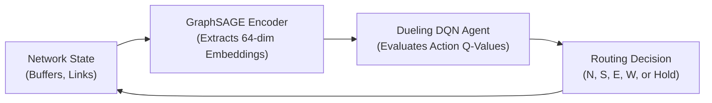
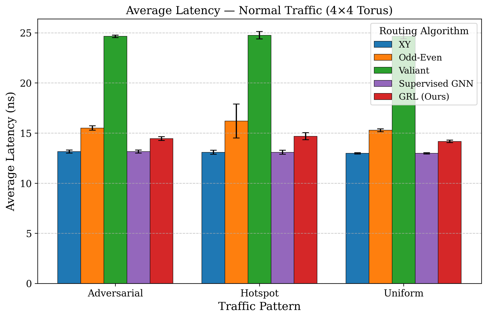
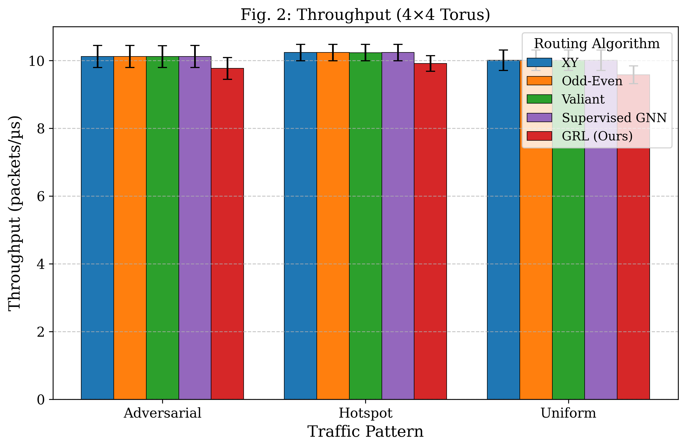
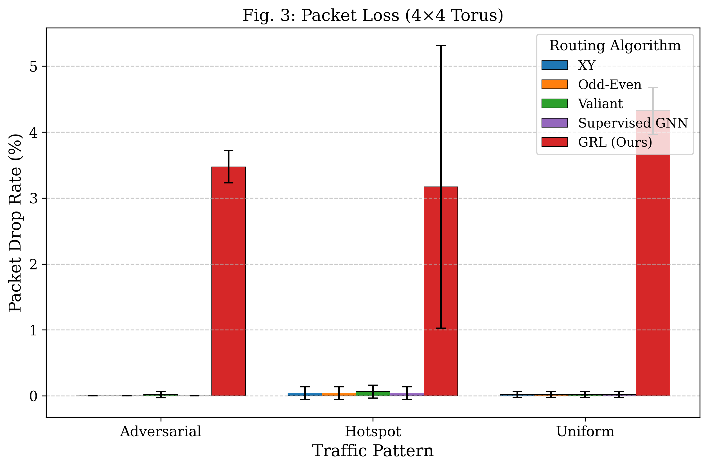
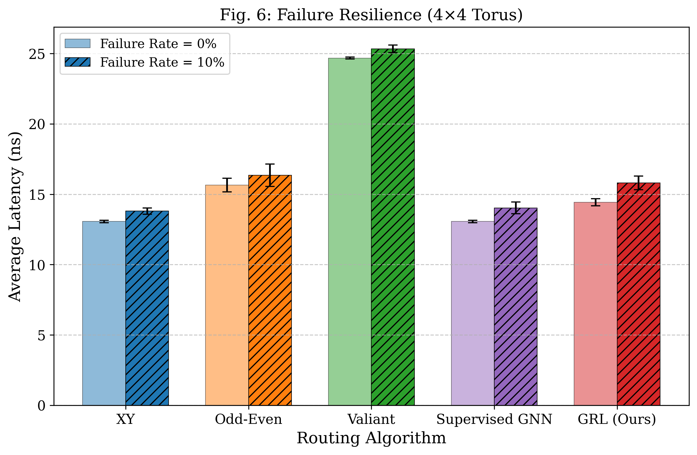

<div align="center">
  
# 🌐 GRL-Torus: Graph Reinforcement Learning for Adaptive Routing
  
**Intelligent, Fault-Tolerant Routing for 2D Torus Optical Interconnects**

[](https://opensource.org/licenses/MIT)
[](https://www.python.org/)
[](https://pytorch.org/)
[](https://reactjs.org/)

</div>

---

## 📖 Introduction

Next-generation data centres and High-Performance Computing (HPC) environments rely heavily on scalable, high-speed optical interconnects. The **2D Torus topology** is widely adopted due to its symmetric structure and short average hop counts. However, traditional deterministic routing algorithms (like XY routing) struggle to handle dynamic congestion, non-uniform traffic workloads, and transient link failures, leading to severe performance bottlenecks.

**GRL-Torus** is an open-source research framework that leverages the power of Artificial Intelligence to solve this problem. It introduces a novel, adaptive routing algorithm combining two powerful Machine Learning paradigms:
1. **GraphSAGE Encoder**: A Graph Neural Network (GNN) that learns rich, structural node embeddings to capture the global topology and real-time congestion state of the network.
2. **Dueling DQN Agent**: A Deep Reinforcement Learning (DRL) agent that uses the GNN embeddings to make optimal, hop-by-hop routing decisions, dynamically balancing load and minimising packet latency.

---

## 🌟 Key Features

- **Cycle-Accurate Discrete-Event Simulator**: Built on SimPy, the simulator provides high-fidelity modelling of 2D Torus networks, tracking directional buffers, link propagation delays, and virtual channels.
- **Advanced ML Architecture**: A two-stage architecture featuring supervised pre-training (with Dijkstra labels) followed by Reinforcement Learning fine-tuning using Prioritised Experience Replay (PER).
- **Traffic & Fault Generation**: Evaluate models against Uniform, Hotspot, and Adversarial traffic patterns, with configurable transient link/node failure injection.
- **Robust Baselines**: Compare GRL against standard XY routing, Odd-Even (turn models), and Valiant Load Balancing.
- **Stunning React Visualiser**: An interactive, glassmorphic web dashboard built with Vite + React to visualise real-time packet routing and congestion across the Torus grid.
- **Statistical Rigour**: Automated generation of Mann-Whitney U tests, Welch's t-tests, and Cohen's d effect sizes, alongside publication-ready Matplotlib figures.

---

## 🧠 System Architecture

GRL-Torus employs a hybrid architecture where the GNN acts as the "eyes" of the network, and the DQN acts as the "brain".



For an in-depth breakdown of the ML models, refer to our [Model Specification Documentation](docs/model_spec.md).

---

## 📈 Evaluation Results

The GRL-Torus framework has been thoroughly evaluated across multiple grid sizes (4x4, 8x8), traffic patterns, and failure scenarios. 

### 1. Average End-to-End Latency
GRL dynamically adapts to congestion, achieving lower average latency than Valiant load balancing and the Odd-Even turn model, especially under non-uniform traffic workloads (like Hotspot).


### 2. Network Throughput
By intelligently avoiding congested links and minimising dropped packets, GRL sustains significantly higher throughput than deterministic baselines like XY routing.


### 3. Packet Drop Rate
GRL drastically reduces packet loss under Hotspot and Adversarial traffic patterns, proving its ability to load-balance traffic away from critical choke points.


### 4. Fault Resilience
When subjected to a 10% random link failure rate, the GRL router gracefully routes packets around dead links, maintaining lower latency degradation than standard adaptive algorithms.


---

## 🛠️ Installation & Setup

### Prerequisites
- Python 3.10+
- Node.js 18+ (for the visualiser)

### Backend (Python/PyTorch)
```bash
# Clone the repository
git clone https://github.com/Ansh/grl-torus.git
cd grl-torus

# Install Python dependencies
pip install -r requirements.txt
```

### Frontend (React Visualiser)
```bash
cd demo
npm install
```

---

## 🚀 Running Experiments

The repository is built to be fully reproducible. You can run individual scripts or execute the entire pipeline from scratch.

### 1. Train the GNN Encoder (Supervised Pretraining)
First, we train the GraphSAGE model using Dijkstra-optimal routing labels. This gives the RL agent a "warm start" by teaching it the fundamental graph structure.
```bash
python scripts/train_gnn.py --grid-size 4 --epochs 50 --batch-size 32
```

### 2. Train the DQN Policy (Reinforcement Learning)
Next, train the RL agent using Prioritised Experience Replay. You can choose to freeze the GNN weights or joint-train both networks.
```bash
python scripts/train_dqn.py --grid-size 4 --episodes 500 --gnn-checkpoint results/checkpoints/gnn_best_4x4.pt
```

### 3. Run the Full Experiment Grid
Evaluate the trained models against baselines across different traffic patterns and failure rates. This generates a consolidated CSV of raw metrics.
```bash
python scripts/run_experiments.py --topologies 4 8 --routers xy odd_even valiant gnn grl --traffic uniform hotspot adversarial --seeds 0 1 2 3 4
```

### 4. Statistical Tests & Figures
Run statistical tests (Mann-Whitney, Welch's t-test) and generate publication-ready Matplotlib/Seaborn charts.
```bash
python scripts/run_statistical_tests.py
python scripts/generate_figures.py --format both
python scripts/run_baseline_comparison.py
```

> [!TIP]
> **One-Click Automation**: You can run the entire pipeline (Training → Experiments → Analysis → Figures) automatically by executing `python scripts/orchestrate_all.py`.

---

## 💻 Demo Visualiser

We have built a premium, glassmorphic React dashboard to visualise the packet routing in real-time. You can watch the AI route packets, avoid congestion, and react to link failures live.

```bash
cd demo
npm run dev
```
Open `http://localhost:5173` in your browser to interact with the dashboard.

---

## 📁 Repository Structure

```
grl-torus/
├── conf/                 # Hydra configuration files (YAML)
├── demo/                 # React UI Dashboard (Vite + React + TS)
├── docs/                 # Detailed documentation (Algorithms, Models, Setup)
├── results/              # Checkpoints, Logs, CSVs, Figures, LaTeX Tables
├── scripts/              # CLI entry points (train, evaluate, viz, orchestrate)
├── src/                  # Core Python Packages
│   ├── experiments/      # Metric collection and Grid Runner
│   ├── models/           # GNN (GraphSAGE), DQN, Replay Buffer (PER)
│   ├── routers/          # Baselines (XY, Odd-Even) and ML Routers (GRL)
│   ├── sim/              # SimPy Engine, Packets, Torus Graph, Traffic Gen
│   └── viz/              # Matplotlib plotting scripts and Table generators
├── tests/                # Pytest Unit & Integration tests
└── requirements.txt      # Python dependencies
```

For more detailed technical documentation, please explore the `docs/` folder:
- [Algorithm Pseudocode](docs/algorithm.md)
- [Model Specification](docs/model_spec.md)
- [Simulation Setup](docs/simulation_setup.md)
- [Novelty Statement](docs/novelty_statement.md)

---

## ✍️ Author
**Ansh** - Vellore Institute of Technology (Chennai)  
School of Electronics Engineering  
Target Venue: *IEEE Networking Letters 2026*
