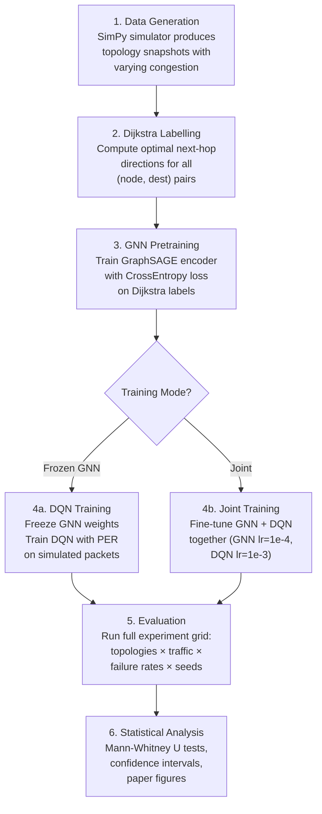

# Algorithm Pseudocode and Training Pipeline

> This document provides formal pseudocode for every algorithm in GRL-Torus,
> verified against the source implementation. Intended for direct inclusion
> in the methodology section of the research paper.

---

## 1. GraphSAGE Forward Pass (3-Layer Message Passing)

**Source**: [graphsage.py:L78-L100](file:///c:/Projects/Optical%20Project/src/models/graphsage.py#L78-L100)

```
Algorithm 1: GraphSAGE Encoder Forward Pass
━━━━━━━━━━━━━━━━━━━━━━━━━━━━━━━━━━━━━━━━━━━━

Input:  x ∈ ℝ^{N×8}       — node feature matrix (N nodes, 8 features each)
        E ∈ ℤ^{2×M}        — edge index (M directed edges)

Output: H ∈ ℝ^{N×64}       — node embedding matrix

1.  h⁰ ← x                                           // Input features
2.  for ℓ = 1, 2, 3 do
3.      h^ℓ ← SAGEConv_ℓ(h^{ℓ-1}, E)                 // Mean aggregation
4.      if ℓ < 3 then
5.          h^ℓ ← BatchNorm_ℓ(h^ℓ)                    // Batch normalisation
6.          h^ℓ ← ReLU(h^ℓ)                           // Non-linearity
7.          h^ℓ ← Dropout(h^ℓ, p=0.1)                 // Regularisation
8.      end if
9.  end for
10. return H ← h³                                     // 64-dim embeddings

where SAGEConv computes:
    h_v^ℓ = W_ℓ · CONCAT(h_v^{ℓ-1}, MEAN({h_u^{ℓ-1} : u ∈ N(v)}))
```

---

## 2. DQN Action Selection (ε-Greedy with Q-Value Fallback)

**Source**: [grl_router.py:L173-L241](file:///c:/Projects/Optical%20Project/src/routers/grl_router.py#L173-L241), [dqn.py:L88-L109](file:///c:/Projects/Optical%20Project/src/models/dqn.py#L88-L109)

```
Algorithm 2: GRL Routing Decision (Per-Hop)
━━━━━━━━━━━━━━━━━━━━━━━━━━━━━━━━━━━━━━━━━━━

Input:  packet p with (src, dst, hops_so_far)
        current_node v = (x, y)
        graph_state G = (node_features, edge_index, adjacency)
        GNN encoder f_θ, DQN network Q_φ
        hold_counter[p.id]

Output: next_hop node v' or None (hold/drop)

 1. if v = p.dst then return None (delivered)
 2. H ← f_θ(G.node_features, G.edge_index)           // Cached per tick
 3. h_v ← H[index(v)]                                 // 64-dim embedding
 4. s_pkt ← [src_x/N, src_y/N, dst_x/N, dst_y/N, hops/(4N)]  // 5-dim
 5. s ← [h_v ∥ s_pkt]                                 // 69-dim state
 6. q ← Q_φ(s)                                        // 5 Q-values
 7. a* ← argmax_a q[a]                                 // Greedy selection
 8. d ← ACTION_MAP[a*]                                // {N, S, E, W, HOLD}
 9.
10. if d = HOLD then
11.     hold_counter[p.id] += 1
12.     if hold_counter[p.id] > 3 then                 // Deadlock prevention
13.         v' ← random active neighbour of v
14.         hold_counter[p.id] ← 0
15.         return v'
16.     end if
17.     return None                                    // Wait for next tick
18. end if
19.
20. hold_counter[p.id] ← 0
21. v' ← neighbour(v, d)
22. if link(v, v') is available then
23.     return v'
24. end if
25.
26. // Fallback: try actions in descending Q-value order
27. for a in sort(q, descending) do
28.     d' ← ACTION_MAP[a]
29.     if d' = HOLD then continue
30.     v'' ← neighbour(v, d')
31.     if link(v, v'') is available then
32.         return v''
33.     end if
34. end for
35. return None                                        // No available link
```

---

## 3. Reward Function

**Source**: [training.py:L484-L524](file:///c:/Projects/Optical%20Project/src/models/training.py#L484-L524)

```
Algorithm 3: GRL Reward Computation
━━━━━━━━━━━━━━━━━━━━━━━━━━━━━━━━━━━━

Input:  delivered ∈ {0,1}, dropped ∈ {0,1}
        hop_delay (ns), util_prev, util_curr

Output: scalar reward r

r ← 0
if delivered then r ← r + 1.0                        // Delivery bonus
if dropped   then r ← r − α                          // α = 10.0
r ← r − hop_delay / 100                              // Latency penalty
r ← r + β · (util_prev − util_curr)                  // β = 0.5
return r
```

---

## 4. DQN Training Loop (Double DQN + PER)

**Source**: [training.py:L567-L972](file:///c:/Projects/Optical%20Project/src/models/training.py#L567-L972)

```
Algorithm 4: DQN Training with Prioritized Experience Replay
━━━━━━━━━━━━━━━━━━━━━━━━━━━━━━━━━━━━━━━━━━━━━━━━━━━━━━━━━━━━

Input:  Pre-trained GNN encoder f_θ
        Dueling DQN policy network Q_φ, target network Q_φ'
        PER buffer B with capacity 100K
        Hyperparameters: γ=0.99, lr=1e-3, ε decay schedule

 1. Q_φ' ← Q_φ                                        // Initialise target
 2. t ← 0                                             // Global step counter
 3.
 4. for episode = 1 to E do
 5.     Create fresh N×N torus topology T
 6.     Optionally inject link failures (p=0.2, rate ∈ [2%, 10%])
 7.     Generate packet batch P from traffic pattern
 8.     H ← f_θ(T.node_features, T.edge_index)         // GNN embeddings
 9.
10.     for each packet p ∈ P do
11.         v ← p.src
12.         for hop = 1 to 4N do
13.             s ← BuildState(H, v, p)                // Algorithm 2, step 5
14.             ε ← linear_decay(t, ε_start=1.0, ε_end=0.05, steps=10K)
15.             a ← ε-greedy(Q_φ, s, ε)
16.             Execute action a → observe (v', delay, util, delivered, dropped)
17.             r ← ComputeReward(delivered, dropped, delay, util)  // Alg 3
18.             s' ← BuildState(H, v', p)
19.             done ← delivered ∨ dropped
20.             B.push(s, a, r, s', done)               // Store with max priority
21.             t ← t + 1
22.
23.             // --- Mini-batch TD Update ---
24.             if |B| ≥ 64 then
25.                 (sⱼ, aⱼ, rⱼ, s'ⱼ, dⱼ, wⱼ) ← B.sample(64)  // PER sample
26.
27.                 // Double DQN: policy selects, target evaluates
28.                 a'ⱼ ← argmax_a Q_φ(s'ⱼ)             // Action from policy
29.                 q_target ← rⱼ + γ · Q_φ'(s'ⱼ)[a'ⱼ] · (1 − dⱼ)  // Value from target
30.                 q_current ← Q_φ(sⱼ)[aⱼ]
31.
32.                 δⱼ ← q_current − q_target             // TD error
33.                 L ← mean(wⱼ · HuberLoss(q_current, q_target))  // IS-weighted
34.                 ∇φ L → Adam step (clip grad norm ≤ 1.0)
35.
36.                 B.update_priorities(δⱼ)               // Update PER priorities
37.
38.                 if t mod 500 = 0 then
39.                     Q_φ' ← Q_φ                        // Hard target update
40.                 end if
41.             end if
42.
43.             if done then break
44.         end for
45.     end for
46.
47.     // Checkpoint best model based on 50-episode moving average reward
48. end for
```

---

## 5. Supervised GNN Pretraining

**Source**: [training.py:L1-L473](file:///c:/Projects/Optical%20Project/src/models/training.py#L1-L473)

```
Algorithm 5: GNN Supervised Pretraining (Dijkstra Labels)
━━━━━━━━━━━━━━━━━━━━━━━━━━━━━━━━━━━━━━━━━━━━━━━━━━━━━━━━━

 1. for each training topology snapshot do
 2.     Create N×N torus with random congestion state
 3.     Optionally inject link failures
 4.     Compute Dijkstra shortest paths from all nodes to all destinations
 5.     For each (node, destination) pair:
 6.         label ← optimal next-hop direction ∈ {N, S, E, W}
 7. end for
 8.
 9. Split data: 80% train / 10% validation / 10% test
10. for epoch = 1 to 100 do
11.     for each mini-batch (x, edge_index, src_idx, dst_idx, labels) do
12.         logits ← GNNRoutingModel(x, edge_index, src_idx, dst_idx)
13.         L ← CrossEntropy(logits, labels)
14.         ∇θ L → Adam step
15.     end for
16.     Evaluate on validation set → early stop if no improvement for 10 epochs
17. end for
```

---

## 6. Full Training Pipeline



---

## 7. Deadlock Prevention Mechanism

**Source**: [grl_router.py:L198-L213](file:///c:/Projects/Optical%20Project/src/routers/grl_router.py#L198-L213)

The GRL router maintains a per-packet hold counter to prevent routing deadlocks:

1. When DQN selects HOLD, increment `hold_counter[packet.id]`.
2. If `hold_counter > 3`: force a **deflection** — route to a random active (non-failed) neighbour, reset counter.
3. On any non-HOLD action: reset counter to 0.

This prevents livelock scenarios where the agent repeatedly holds at a congested node. The threshold of 3 holds provides a balance between allowing brief congestion waits and preventing indefinite blocking.

---

## 8. Baseline Router Algorithms

### XY Routing (Deterministic Shortest Path)
**Source**: [xy_router.py](file:///c:/Projects/Optical%20Project/src/routers/xy_router.py)

Route first along the X-axis, then along the Y-axis. Always uses the shortest wraparound distance. Deadlock-free but cannot avoid congested links.

### Odd-Even Turn Model (Adaptive)
**Source**: [odd_even_router.py](file:///c:/Projects/Optical%20Project/src/routers/odd_even_router.py)

Restricts certain turns at even-column nodes to prevent deadlocks while allowing limited adaptivity. Uses 2 virtual channels.

### Valiant Load Balancing (Randomised)
**Source**: [valiant_router.py](file:///c:/Projects/Optical%20Project/src/routers/valiant_router.py)

Two-phase routing: (1) route to a random intermediate node using XY, (2) route from intermediate to destination using XY. Doubles average hop count but eliminates hotspots.
